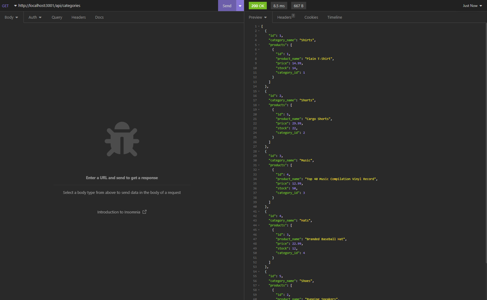

# E-commerce Back End 

## Description

This project comprises of back-end code for an e-commerce website that configures a working Express.js API into Sequelize to interact with a MySQL database.

## Usage
1. Install npm: npm init -y
2. In terminal, seed your DB typing ```npm run seed```
3. In terminal, type ```npm start``` to start the program.
4. Open Insomnia and enter Get, Post, Put, and Delete requests.
5. Use MySQL to check table statuses (if preferred).

## Screenshots



## Technology Used
- Node.js
- Sequelize
- MySQL
- JavaScript
- Express.js
- Dotenv


## Contact

App GitHub Link - https://github.com/Hugooloya/13-E-commerce-Back-End
Video Link - https://drive.google.com/file/d/1CsDfQGlxJjMF76rjbO9WhICfL5NWOvkF/view